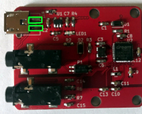
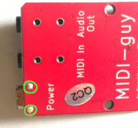

# MIDI野郎 by 木下研究所
MIDI野郎キットは、ワンチップGM音源IC、SAM2695を使った音源モジュールです。GM音源の127種類の音が出るほか、エフェクトやEQなども使えます。詳細は、SAM2695のデータシート(https://www.dream.fr/pdf/Serie2000/SAM_Datasheets/SAM2695.pdf)を参考にしてください。

# キットの内容
- 部品実装済み基板
- microUSB型電源コネクタ

# キット以外に必要なもの
- マイクロUSBケーブル
- USB電源アダプターまたはPCなど、USBケーブルをつないで電源にできるもの
- MIDIケーブル、DIN->TRS変換ケーブル(3.5mm TRS MIDI Inをそのまま使えるMIDIコントローラーを使う場合は3.5mmTRSケーブル)

# 組みたてかた
USB電源コネクタをはんだづけします。はんだ付けするのは、下の図で囲まれている表裏2ヶ所ずつです。

# 使い方
- Power: USB電源アダプタからの電源をつなぎます。
- MIDI In: MIDI鍵盤や、MIDIインターフェースなどのMIDI信号をここに入力します。
- Audio Out: ここから音が出ます。ヘッドフォンを直接さすこともできます。

# 回路図などの詳細、不具合情報など
こちらにあります。
https://github.com/kinoshita-lab/MIDI-guy

