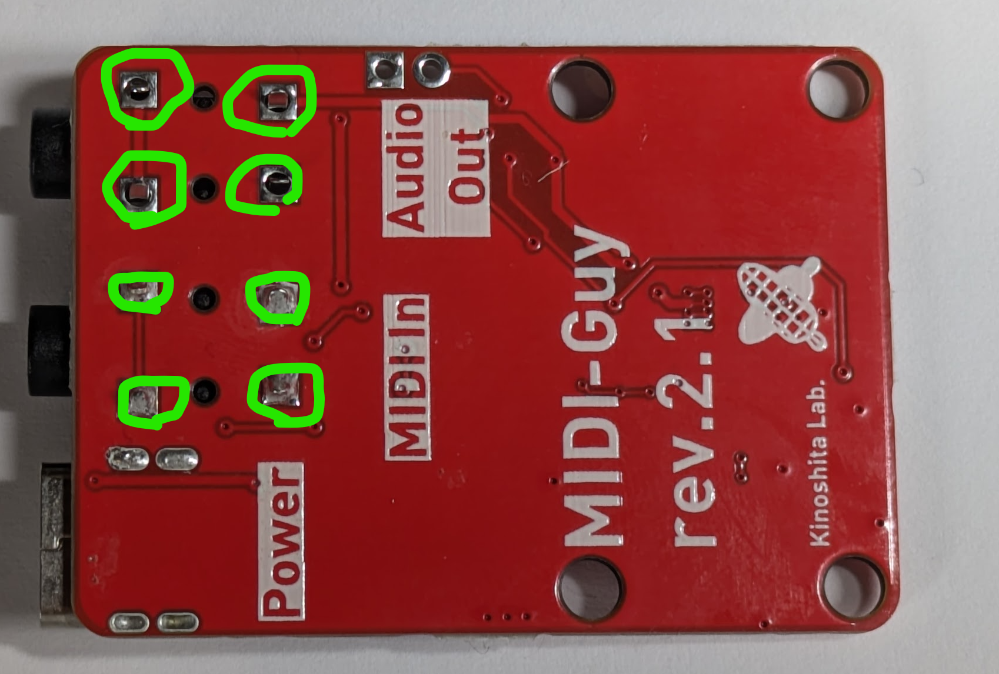

# MIDI Guy by Kinoshita Laboratory

MIDI Guy is a sound module with SAM2695, a single chip General MIDI(GM) synthesizer.
It can generate GM's 127 sound programs such as "Acoustic Grand Piano", "Trumpet", etc.

You can also use effects and EQs. Please refer to the SAM2695's datasheet for details.
<https://www.dream.fr/pdf/Serie2000/SAM_Datasheets/SAM2695.pdf>

## What's new for Revision 2.1

- USB Power input is replaced from micro USB to USB Type-C
- PCB Dimension modification: fit for Frisk case
- Support both TRS MIDI type A and B
- Add UART In terminal for the convinience using with microcontroller

## Kit contents

- Pre-assembled circuit board
- 2 pcs. of 3.5mm TRS Jack

## What you will need

- USB C Cable
- Power source for USB, such as power adapter or PC
- DIN->TRS conversion cable(for MIDI Input)
- MIDI cable
- MIDI Output Device e.g. MIDI Keyboard, PC with MIDI Interface

## How to assemble

Solder the included TRS Jacks to the places shown below.

  

## Usage

- Power: Connect the power source from USB
- MIDI In: Connect a MIDI message source(e.g. MIDI Keyboard, MIDI Interface connected to a PC)
- Audio Out: Outputs stereo sound, you can connect headphones directly.

## Schematics, design data, questions

<https://github.com/kinoshita-lab/MIDI-guy>
